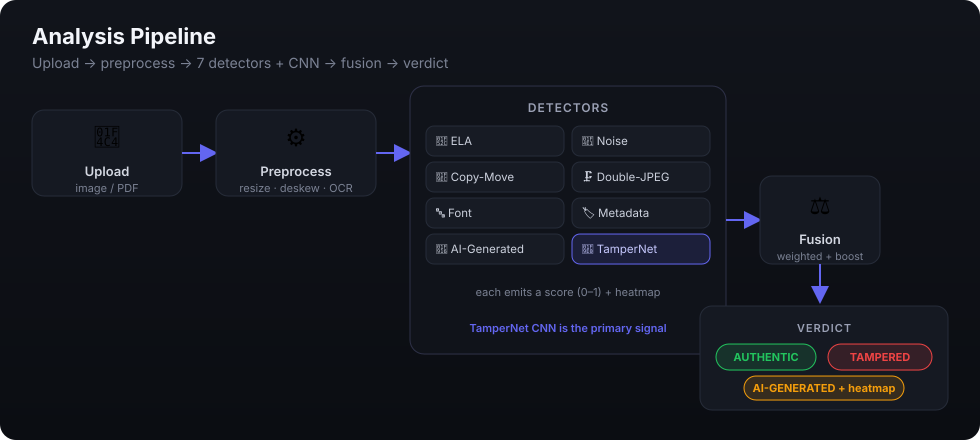
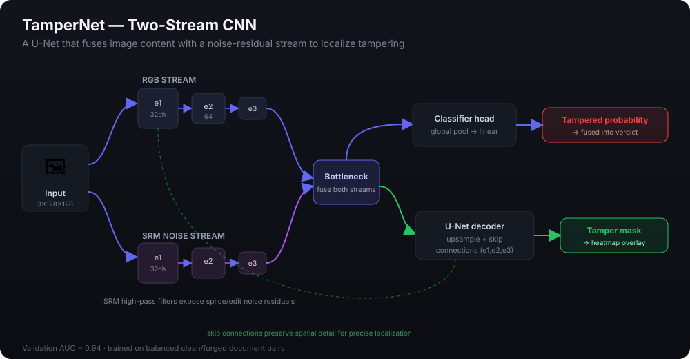
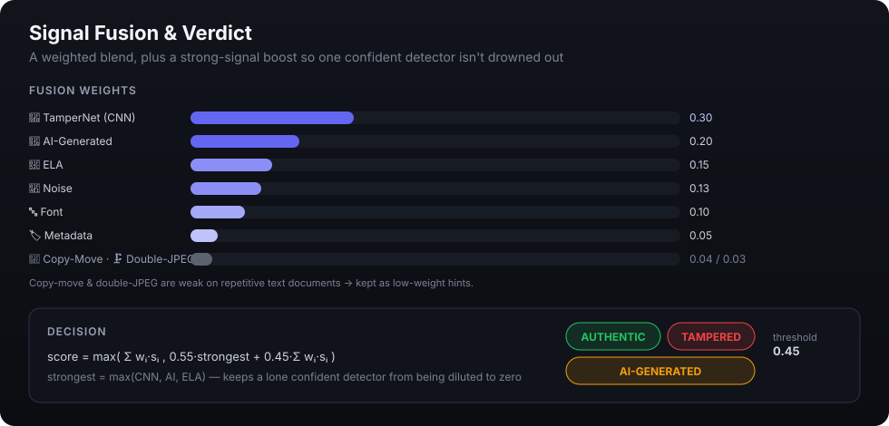

# 🔍 DocForensics — Document Tampering & Forgery Detector

A computer-vision system that inspects documents and images for signs of
manipulation. It combines **seven classical forensic detectors** with a
**trained two-stream CNN** and fuses their signals into a single verdict —
**AUTHENTIC**, **TAMPERED**, or **AI-GENERATED** — with a heatmap showing *where*
the suspicion lies.


---

## How it works

The uploaded file is preprocessed, then analyzed by eight detectors in parallel.
Their scores and heatmaps are fused into one verdict.

<p align="center">
  
</p>

| Detector | Looks for |
|---|---|
| **ELA** | Error-level inconsistencies from re-compression |
| **Noise** | Local noise-fingerprint mismatches at splice edges |
| **Copy-Move** | Cloned/duplicated regions (offset-clustered) |
| **Double-JPEG** | Periodic artifacts of re-compression |
| **Font forensics** | Baseline / anti-aliasing inconsistencies in text |
| **Metadata** | Editor software, incremental PDF edits, date mismatches |
| **AI-generated** | Frequency signature + a Hugging Face classifier |
| **TamperNet (CNN)** | Learned tamper localization — the primary signal |

---

## The model — TamperNet

TamperNet is a **two-stream U-Net**. One stream sees the RGB image; the other sees
a **noise residual** produced by fixed SRM high-pass filters, which exposes the
subtle noise discontinuities that editing leaves behind. The streams are encoded
separately, fused at a bottleneck, and decoded with skip connections back to a
full-resolution **tamper mask**. A parallel classification head produces an overall
**tampered probability**.

<p align="center">
  
</p>

- **Two streams** — RGB (content) + SRM noise (forensic residual)
- **Encoder** — 3 conv blocks per stream (32 → 64 → 128 channels) with pooling
- **Bottleneck** — concatenates both streams and fuses them
- **Two heads** — a classifier (tampered probability) and a U-Net decoder (mask/heatmap)
- **Skip connections** preserve spatial detail so the heatmap is sharp

**Training.** The critical detail is the dataset: genuine and tampered classes
contain the **same source documents** (a clean augmented copy *and* a forged copy
of each), so the network learns *tampering* rather than memorizing document
identity. With balanced classes (`pos_weight ≈ 1.0`), validation **AUC reaches
~0.94**.

---

## Fusion & verdict

Detector scores are combined with a weighted average, plus a **strong-signal
boost** so a single confident detector can't be averaged into silence. The most
reliable signals (CNN, AI-classifier, ELA) carry the most weight; copy-move and
double-JPEG — which are noisy on repetitive text — are low-weight hints.

<p align="center">
  
</p>

---

## Architecture

```
ingestion → preprocessing → OCR → ┌─ 7 forensic detectors ─┐
                                   ├─ TamperNet CNN          ├─ fusion → Verdict + heatmap
                                   └────────────────────────┘
                       FastAPI (REST + serves the React UI)
```

**Tech stack** — FastAPI · PyTorch · OpenCV · scikit-image · PyMuPDF · Transformers
· React + Vite. **87 tests** across unit / integration / API / model layers.

---

## Quick start (local dev)

```bash
# Backend
python -m venv venv && source venv/bin/activate
pip install -r requirements.txt
uvicorn api.main:app --port 8000

# Frontend (separate terminal)
cd frontend && npm install && npm run dev
# open http://localhost:5173   (proxies /api → :8000)
```

## Run the whole app in one container

```bash
docker compose up --build
# open http://localhost:8000
```

## Tests

```bash
pytest tests/ -v        # 87 tests
```

## Deployment

See **[DEPLOYMENT.md](DEPLOYMENT.md)** — single-container Docker, with step-by-step
guides for Hugging Face Spaces, Render, Railway, Fly.io, and split
frontend/backend hosting.

---

## Honest limitations

- Trained on **synthetic** forgeries (CPU). It reliably separates clean documents
  from forged ones, but very small/subtle copy-move patches can sit near the
  decision boundary.
- Copy-move and double-JPEG are weak on text-heavy documents (legitimate
  repetition mimics tampering), so they're low-weight hints; the CNN carries the
  verdict.
- The first request downloads a ~350 MB AI-detector model, then caches it.
  Set `DOCFORENSICS_DISABLE_AI_MODEL=1` to skip it on memory-constrained hosts.

---

## Author

**Developed by Surya Karthik**

- 💼 LinkedIn: [linkedin.com/in/surya-karthik-](https://www.linkedin.com/in/surya-karthik-)
- 📧 Get in touch: [g.suryakarthik@gmail.com](mailto:g.suryakarthik@gmail.com)

Feedback and contributions are welcome — feel free to open an issue or reach out.
